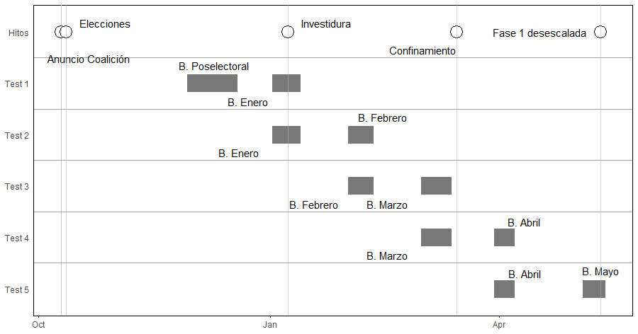

```{r setup, include=FALSE}
knitr::opts_chunk$set(
	message = TRUE,
	warning = TRUE,
	include = FALSE
)
library(png)
```
<!-- <If we don't want to number a section> -->
# Introducci贸n {-}  
La irrupci贸n de la pandemia de la COVID 19 nos ofrece una ventana de oportunidad para estudiar los efectos que pueden ejercer suscesos disruptivos sobre la habitual relaci贸n existente entre las car谩cter铆sticas de los individuos y sus actitudes y comportamientos pol铆ticos. 
En este caso nos hemos fijado en la relaci贸n entre la ideolog铆a y la valoraci贸n que los ciudadanos hacen del Presidente del Gobierno. Para ello disponemos de una fuente de datos, el CIS, que nos ofrece instant谩neas de la sociedad espa帽ola tomadas a intervalos m谩s o menos regulares. Sus bar贸metros recogen las respuestas a un n煤cleo de preguntas que se ha mantenido constante en el periodo de estudio por lo que tenemos la oportunidad de inferir cambios temporales a partir de ellos.
La declaraci贸n del estado de alarma y el consiguiente confinamiento de toda la poblaci贸n del pa铆s a partir del 14 de marzo de 2020 supone un suceso traum谩tico colectivo como no se hab铆a vivido hasta el momento. Por ello, nos parece razonable plantear la hip贸tesis de que esta decisi贸n pol铆tica suponga un shock que altere la forma en que los ciudadanos valoran la actuaci贸n de los actores pol铆ticos, ya sean institucionales, organizaciones como los partidos pol铆ticos o los propios pol铆ticos. 

# Dise帽o de la investigaci贸n y datos utilizados  
Se ha elegido la figura presidencial como objeto de la valoraci贸n ciudadana ya que durante el confinamiento, al quedar suspendida la circulaci贸n, salvo de los trabajadores esenciales, y la permanencia en los espacios cerrados sin posibilidad de mantener las distancias, la actividad parlamentaria y partidista se redujo a la m铆nima expresi贸n. Esta situaci贸n provoc贸 que la ciudadan铆a mantuviera una relaci贸n pol铆tica estrecha con el presidente del gobierno como receptores de su comunicaci贸n diaria ante la pr谩ctica desaparici贸n de las labores de oposici贸n.
Para determinar que existe un cambio estructural en la relaci贸n ideolog铆a-valoraci贸n planteamos una investigaci贸n en varias etapas. En primer lugar hemos modelizado la relaci贸n entre nuestras variables considerando que 茅sta pod铆a ser no lineal. De esta forma permitimos comportamientos disonantes en los extremos ideol贸gicos. Adem谩s hemos inclu铆do una serie de controles por caracter铆sticas socioecon贸micas. En concreto controlaremos los efectos del g茅nero, el nivel educativo y la clase social percibida. Por motivos de simplicidad, estas tres variables se han dicotomizado.
Esta relaci贸n expresada en la forma de una regresi贸n lineal m煤ltiple ser铆a de la forma:
$$y_i=\beta_0+\beta_1 x_i +\beta_2 x_i^2 +\beta_3 x_i^3+\mathbf{\gamma}\mathbf{z}_i+\epsilon_i$$
donde $y_i$ ser铆a el valor que cada entrevistado $i$ asigna en un momento $t$ a la pregunta de c贸mo valora la actuaci贸n del presidente S谩nchez del 1 al 10, siendo 1 "muy mal" y 10 "muy bien"; la variable independiente $x_i$ se refiere a la autoubicaci贸n ideol贸gica^[En este trabajo se ha optado por centrar esta variable en relaci贸n a la media de cada periodo $t$.  
La interpretaci贸n de la variable a trav茅s de diferentes periodos no resulta m谩s compleja ya que se han realizado test de _Welch_ de diferencia de medias pertenecientes a muestras diferentes, para descartar que existieran diferencias estad铆sticas entre las medias que sirven para centrar la variable. La 煤nica diferencia significativa al $\alpha = 0.05$ es de tan s贸lo 0.144 puntos y no altera la interpretaci贸n de los an谩lisis realizados en este trabajo.] de los entrevistados, donde el 1 significa izquierda y el 10 derecha. Finalmente se ha denominado $\mathbf{z}_i$ a una serie de controles establecidos mediante variables dicot贸micas de g茅nero, nivel educativo y estatus socioecon贸mico
En la modelizaci贸n de los efectos de la ideolog铆a se ha incluido t茅rminos hasta el orden c煤bico^[la ideoneidad de a帽adir los t茅rminos cuadr谩tico y c煤bico para moderar el comportamiento del t茅rmino lineal se ha relizado mediante la realizaci贸n de test de _Likelihood Ratio_ que demostraban que en todos los periodos el t茅rmino cuadr谩tico era mas adecuado que el simple y 茅ste a su vez menos adecuado que el c煤bico, a excepci贸n da las muestras a partir de abril donde el cuadr谩tico no era mejor que el lineal, pero el c煤bico segu铆a siendo mejor que el lineal] $x_i^3$ con el objeto de tener en cuenta un posible comportamiento no lineal y cambios de tendencia en los extremos.
Sin embargo esta ecuaci贸n (1) s贸lo nos sirve para modelizar la valoraci贸n del presidente en un momento dado del tiempo. Para comprobar que esta relaci贸n var铆a a lo largo del tiempo, idealmente utilizar铆amos datos de tipo longitudinal o de panel, sin embargo, al no disponer de ellos realizaremos las correspondientes inferencias mediante el sistma conocido como _pooled cross-sectional_. Este tipo de datos consiste en la agregaci贸n de varias muestras estad铆sticas correspondientes a la misma poblaci贸n pero en momentos diferentes en el tiempo. La principal diferencia entre los _pooled cross-sectional data_ y los datos de panel es que los individuos seleccionados no tienen por qu茅 ser los mismos. 
Por lo tanto nuestro dise帽o de investigaci贸n consistir谩 en agrupar nuestros datos de forma que tengamos una configuraci贸n _before/after_ y pretendemos comprobar si la diferencia entre las l铆neas de mejor ajuste de la regresi贸n en cada momento en el tiempo es estad铆sticamente significativa. Es decir, se trata de un problema de lo que en econometr铆a se conoce como detecci贸n de un cambio estructural. Para ello vamos a utilizar un modelo con una variable dummy $\delta$, como alternativa al test de Chow(1960) que nos ayude a operacionalizar el paso del tiempo. As铆, esta variable $\delta$ adoptar谩 un valor de $0$ para el conjunto de datos _before_ y $1$. Al an谩lizar la diferencia entrer un momento, el antes, previo a la declaraci贸n del estado de alarma y un momento, el despu茅s, posterior a la declaraci贸n pretendemos encontrar el efecto de dicho fen贸meno. 
El problema de este dise帽o es que presenta amenazas a su validez interna. Es decir, al no tratarse de un dise帽o experimental o cuasi experimental, la diferencia _before/after_ podr铆a ser debida a una variable no tenida en cuenta en lugar de a nuestra variable . Sin embargo, al tratarse de una medida que se implant贸 en todo el territorio nacional, no podemos establecer una subdivisi贸n de nuestras muestras de forma que tuvieramos individuos no sometidos al confinamiento, el grupo _control_ y un grupo que s铆 lo estuviera, el grupo _tratamiento_. Si pudi茅ramos tener ambos grupos llevar铆amos a cabo un an谩lisis de _Diferencias en diferencias_.  Adem谩s existe otra amenaza a la validez proveniente del instrumento de medida. Debido precisamente al confinamiento el CIS tuvo que realizar sus entrevistas de manera telef贸nica y no presenciales como de costumbre. Este sistema puede producir un sesgo de selecci贸n. Para disminuir los riesgos relativos a la validez interna del dise帽o de la investigaci贸n se han incluido an谩lisis adicionales descritos m谩s adelante. Por otro lado para lidiar con los sesgos de selecci贸n provocados por la variaci贸n del instrumento de medida se han introducido los controles en los an谩lisis. 
El modelo que pretendemos utilizar para detectar un posible punto de cambio estructural debido a la declaraci贸n del estado de alarma y la vida bajo confinamiento adoptar谩 la forma:
$$y_i=\beta_0+\tau_0 \delta_i+ \beta_1 x_i+\beta_2x_i^2+\beta_3x_3^2+\tau_1\delta_i x_i+\tau_2\delta_i x_i^2+\tau_3\delta_i x_i^3+ \mathbf{\gamma} \mathbf{z}_{i} + \epsilon_{i}$$
Si desglosamos la ecuaci贸n (2) podremos despojarla de su complejidad inicial para ver que tiene 
dos componentes principales definidos visualmente por sus coeficientes. En primer lugar vemos que los coeficientes $\beta$ y $\gamma$ son aquellos que ya estaban presentes en la ecuaci贸n (1). Los controles no van a ser utilizados para el contraste de hip贸tesis y cumplen una mera funci贸n de control, es decir pretendemos mantenerlos constantes y descontar su impacto a efectos predictivos. Todos aquellos t茅rminos a contrastar que no contienen la variable dummy $\delta$ nos dan informaci贸n del momento _before_ y llevan asociados un coeficiente $\beta$. El coeficiente $\beta_0$ equivale a la valoraci贸n media que realiza un individuo del grupo _before_ cuya ubicaci贸n ideol贸gica coincida con la ubicaci贸n media de los individuos de su muestra temporal. $\beta_1, \beta_2, \beta_3$ por su parte, determinan la forma de la curva^[Su interpretaci贸n es menos intuitiva que en el caso de los t茅rminos lineales y no es de gran utilidad en este caso. Estamos interesados en la significatividad de los coeficientes.] que relaciona ideolog铆a y valoraci贸n en el momento previo.
Para determinar los efectos de nuestro _tratamiento_ hemos utilizado los coeficientes $\tau$. As铆, $\tau_0$ ser谩 la diferencia entre la valoraci贸n media que realizan los individuos que se encuentran en cada uno de los grupos _before_ y _after_. Es decir la valoraci贸n media de los individuos del grupo _after_ cuya ubicaci贸n es la media de los individuos de su grupo ser谩 $\beta_0 + \tau_0$ y de la misma forma $\tau_1, \tau_2$y$\tau_3$ ser谩n, respectivamente, los complementos de $\beta_1, \beta_2$y$\beta_3$, para determinar la relaci贸n ideolog铆a-valoraci贸n en el momento posterior.
Por lo tanto, para determinar si el confinamiento y la crisis multidimensional subsiguiente han provocado un cambio estructural en la forma en que la ideolog铆a influye sobre la valoraci贸n del presidente del gobierno realizaremos un contraste de hip贸tesis **H~0~**:$\ \tau_0 = \tau_1 =\tau_2=\tau_3=0$ siendo nuestra **H~A~** cualquiera de los posibles incumplimientos de la hip贸tesis nula.
Esperamos que si nuestro planteamiento es correcto el impacto sea significativo y podamos decir que se ha producido un cambio estructural a partir de la declaraci贸n del estado de alarma. Para ello debemos seleccionar los datos del bar贸metro inmediatamente posterior a la declaraci贸n del estado de alarma y los inmediatamente anteriores. Al acotar de la manera m谩s estrecha posible el rango temporal alrededor de nuestro evento disruptivo, tratamos de minimizar la ocurrencia de eventos que puedan ser la verdadera causa de un potencial cambio estructural, en lugar de nuestro evento de inter茅s.  
Adem?s de los mencionados riesgos de validez interna, existen amenazas de fiabilidad de nuestros instrumentos de medida. Los tests aplicados sobre muestras diferentes, podr?an producir coeficientes diferentes^[Con diferencias estad铆sticamente significativas]. Es decir, que medidas consecutivas sobre una misma poblaci?n produjeran resultados diferentes. Aunque no tenemos la posibilidad de realizar mediciones repetidas en un mismo momento, la regularidad cuasimensual de los bar贸metros del CIS, nos permiten repetir las mediciones durante periodos en los que no se ha producido el fen?meno que nosotros consideramos responsable del potencial cambio estructural. Por lo tanto, repitiendo sucesivamente el an?lisis en diferentes momentos. 
En la figura (1) puede verse de forma esquem�tica la estructura temporal de nuestro dise�o de investigaci�n. Existen cinco tests _before/after_ y una serie de sucesos o hitos pol�ticos relativos al gobierno que preside Pedro S�nchez. Puede verse que cada test agrupa dos estudios del CIS^[Los estudios numerados del 1 al 6 son respectivamente, los estudios: 3269, 3271, 3273, 3277, 3279, 3281] de los que se muestra la duraci�n del trabajo de campo correspondiente y su inserci�n entre sucesos pol�ticos. 

De la figura (1) se desprende que es el test 4 el que contiene la ocurrencia del suceso de estudio.


